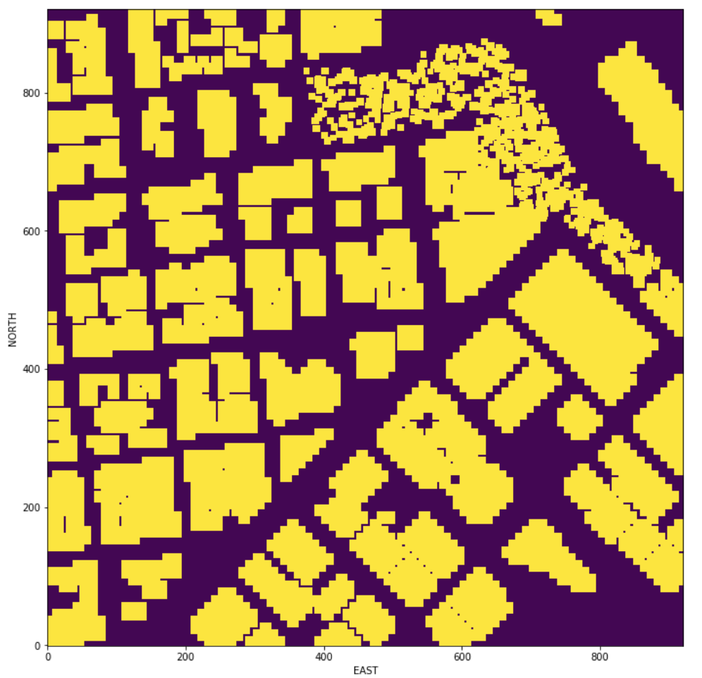
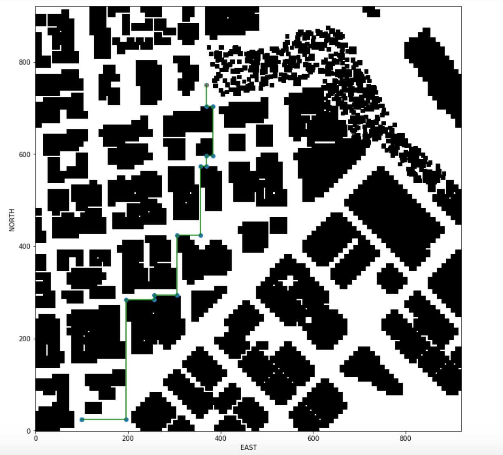

## Project: 3D Motion Planning

---

# Required Steps for a Passing Submission:
1. Load the 2.5D map in the colliders.csv file describing the environment.
2. Discretize the environment into a grid or graph representation.
3. Define the start and goal locations.
4. Perform a search using A* or other search algorithm.
5. Use a collinearity test or ray tracing method (like Bresenham) to remove unnecessary waypoints.
6. Return waypoints in local ECEF coordinates (format for `self.all_waypoints` is [N, E, altitude, heading], where the drone start location corresponds to [0, 0, 0, 0].
7. Write it up.
8. Congratulations!  Your Done!

### Writeup / README

Demo:   

### Explain the Starter Code

#### 1. Explain the functionality of what's provided in `motion_planning.py` and `planning_utils.py`
I implemented `plan_path function` in `motion_planning.py` with following work through:   

 * Read lat0, lon0 from colliders into floating point values.   
 * Set home position to (lon0, lat0, 0).    
 * Retrieve current global position.
 * Read in obstacle map.
 * Create a grid for a particular altitude and safety margin around obstacles.
 * Convert start position to current position rather than map center.
 * Set goal as latitude / longitude position and convert.
 * Run A* to find a path from start to goal.
 * Prune path to minimize number of waypoints.
 * Convert path to waypoints and sent to the Sim.
 
 `planning_utils.py` contain the following function:

 * create_grid() function.
 * Action Class.
 * valid_actions() function.
 * a_star() function.
 * read_lat_lon() function
 * collinearity_check() function.
 * prune_path() function.
 * heuristic() function.

And here's a lovely image of my results (ok this image has nothing to do with it, but it's a nice example of how to include images in your writeup!)

### Implementing Your Path Planning Algorithm

#### 1. Set your global home position
Here I implement a function `read_lat_lon()`to read the first line `lat0 37.792480, lon0 -122.397450` of the csv file, extract lat0 and lon0 as floating point values and use the `self.set_home_position()` method to set global home. The code is in `motion_planning.py` line [123 to 130](motion_planning.py#L123-L130) and `planning_utils.py` line [152 to 160.](planning_utils.py#L152-L160)     

And here is a lovely picture of our downtown San Francisco environment from above!

    
Here I read in obstacle map  use `np.loadtxt()` then use `create_grid()` to returns a grid representation of a 2D configuration space based on given obstacle data, drone altitude and safety distance arguments. The code is in `motion_planning.py` line [139 to 144](motion_planning.py#L123-L130) and `planning_utils.py` line [6 to 41.](planning_utils.py#L6-L41)     

#### 2. Set your current local position
Retreived the drone's current position in geodetic coordinates from `self.global_position`, and the global home position set from last step from `self.global_home`, then used the utility function `global_to_local()` convert the current global position to local position. The code is in `motion_planning.py` line[132 to 133](motion_planning.py#L132-L133)   

#### 3. Set grid start position from local position
For adding flexibility to the start location instead hardcoded in the map center I changed the code in `motion_planning.py` line[149 to 150](motion_planning.py#L149-L150)   

#### 4. Set grid goal position from geodetic coords
This step is to add flexibility to the desired goal location. Should be able to choose any (lat, lon) within the map and have it rendered to a goal location on the grid.
the code in `motion_planning.py` line[154 to 155](motion_planning.py#L154-L155)   
    
#### 5. Modify A* to include diagonal motion (or replace A* altogether)
Update the A* implementation to include diagonal motions on the grid that have a cost of sqrt(2). In
`a_star() function` Use `PriorityQueue` data structure to quickly and efficiently select the lowest cost partial plan from queue of all partial plans. The code is in  `planning_utils.py` line [60 to 63.](planning_utils.py#L60-L63)   

   

#### 6. Cull waypoints 
For this step I use a collinearity test. The idea is simply to prune path of unnecessary waypoints.
If the 3 points are in a line remove the 2nd point. The 3rd point now becomes and 2nd point and the check is redone with a new third point on the next iteration. The code is in  `planning_utils.py` line [165 to 192.](planning_utils.py#L165-L192)     

### Double check that you've met specifications for each of the [rubric](https://review.udacity.com/#!/rubrics/1534/view) points.
  
# Extra Challenges: Real World Planning

For an extra challenge, consider implementing some of the techniques described in the "Real World Planning" lesson. You could try implementing a vehicle model to take dynamic constraints into account, or implement a replanning method to invoke if you get off course or encounter unexpected obstacles.

